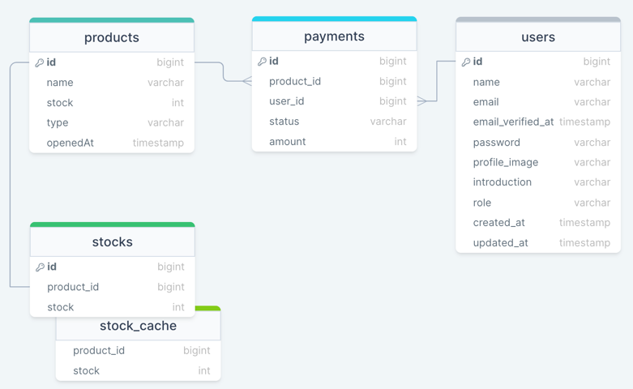

# order-system-backend

이 프로젝트는 결제 서비스의 백엔드 서비스입니다.

## 목차

- [사용된 기술](#사용된-기술)
- [모듈](#모듈)
- [ERD](#ERD)
- [문서](#문서)
- [실행하는 법](#실행하는-법)

## 사용된 기술

- Java SDK 17
- Spring Boot 2.7.9
- Redis
- Postgres
- Docker
- Eureka

## 모듈

| 서비스           | 설명                                       | 권한 부여          | 포트 번호 |
|---------------|------------------------------------------|----------------|-------|
| 사용자 서비스       | 사용자 관련 작업을 관리                            | jwt 토큰으로 권한 검사 | 8080  |
| 결제 서비스        | 결제 관련 기능을 처리                             | -              | 8081  |
| 상품 서비스        | 상품 관련 기능을 처리                             | -              | 8082  |
| 재고 서비스        | 재고 관련 기능을 처리                             | -              | 8083  |
| API 게이트웨이 서비스 | 외부 통신을 위한 게이트웨이 역할,<br/>요청을 적절한 서비스로 라우팅 | jwt 토큰으로 권한 검사 | 8000  |
| Eureka 서비스    | 서비스 검색 및 등록 담당                           | -              | 8761  |

## ERD



- 결제 서비스
    - products
        - 결제에 필요한 최소 정보만 저장
        - `type` : 예약 구매 물건인지 아닌지 String 형식으로 저장
        - `openedAt` : 예약 구매 물건이라면 언제 오픈되는지 저장
    - payments
        - 동시에 여러 물건을 살 수 없다고 가정하고 product_id를 payment에 저장
        - `status` : 결제 진입, 결제 취소, 결제 실패, 결제 완료
- 실시간 재고 관리 서비스
    - stocks
        - redis cache 사용
        - 재고 정보 저장

## 문서

> - [API 명세](https://linktodocumentation)

## 실행하는 법

> - 빌드하고 실행
> ```bash
> docker compose up --build
> ```
> - 단일 모듈 빌드 후 실행
> ```bash
> docker compose up --build {service-name}
> ```
> - 빌드하지 않고 실행
> ```bash
> docker compose up
> ```
